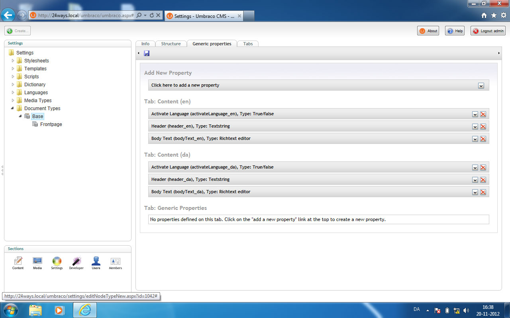

# 1-1 multilingual websites in Umbraco
Classic problem in Umbraco, you have a 1-1 multilingual website, but Umbraco isn't quite made for handling that. This is how we, in our company, normally handle that. Usually there's quite a bit of custom stuff to handle, as their not quite 1-1 anyways, but that I won't cover in this article.
## What is 1-1 multilingual websites
Quite simply, it's when you have the exact same pages in every language. A CMS like SiteCore would handle it with the abillity to version any given item in several languages by clicking a flag in the backend, and then using culture codes to fetch the right language.
## How to handle in Umbraco's backoffice
First off, we're giving the user several tabs in any document template representing the different languages. Then what we do, is to postfix all our fields with the culture code when creating them in the document type. See screenshot for my example.

When postfixing, we have the opportunity to fetch them from our macro's (I'll be doing it in XSLT).
If not all pages have all languages, you could make a boolean field, that "activates" the language edition. This will typically help you in your navigation macros, so the pages not available in current language actually won't show in navigation.
## Detecting current language from XSLT
So, for some odd reason there's no extension method for fetching current culture in default Umbraco (I know there are packages around doing that). But there's a very simple hack you could do, and i quite like it.
You simply create a dictionary item, I call it "currentCulture", and then fill your field postfix texts in each language ('da' and 'en').
## Helper XSLT's
I really like to make and use default helper xslt's (Thanks a bunch @greystate for the inspiration). This is basically a seperate XSLT file I include in pages where needed, containing some templates and some variables I use sitewise. In this case I use This is [_MultiLingualHelper.xslt](XSLT/_MultiLingualHelper.xslt "XSLT File"). The methods I'll be storing in this file is:
- Language detection (variable named $lang)
- Complete postfix for fields ($lang_postfix)
- A helper for fetching active pages in current language **(at least som documentation on that)**.
## Fetching the right version of the field
Now for fetching the right version of a field, I'll use some xPath.

	*[name() = concat('header', $lang_postfix)]

Explained shortly, the concat part add's _da or _en to the fieldname, and we then fetches the field that has that name. Easy peasy.
## Setting up hostnames
Now for the system to detect wich language / culture the user wants we use sub-domains. www.domain.com and da.domain.com. Simply use native umbraco features to set up **hostheaders** per domain.
Is the sub-domain or extension domain necessary? Yeah, I do believe that it is, since you have to be very careful not to make duplicate content, as Google won't like that. Of course there is the opportunity to do it all without domain changes, but I like the clear and obvious solution it provides.
## Changing language
## Navigation snippets
